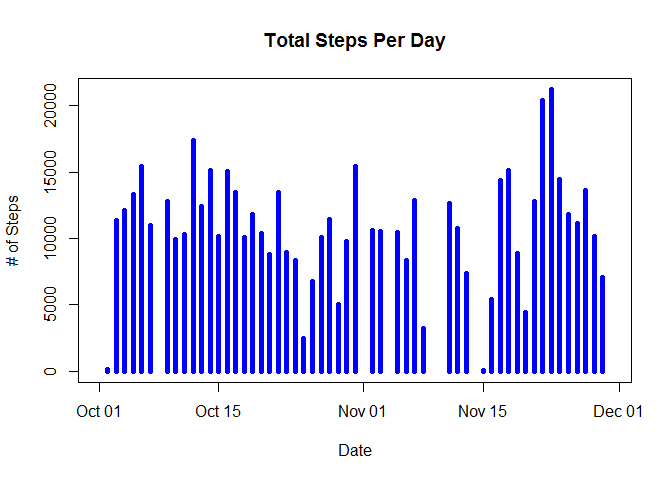
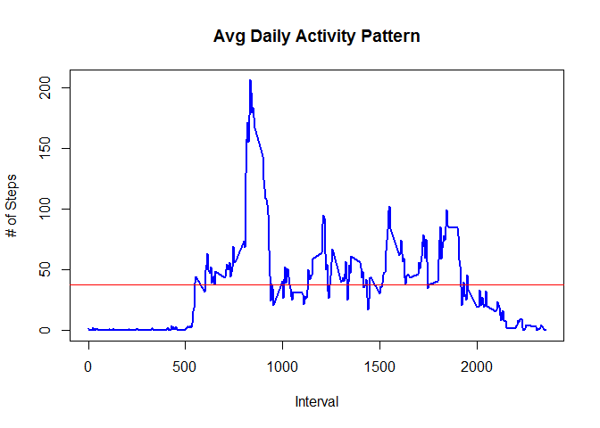
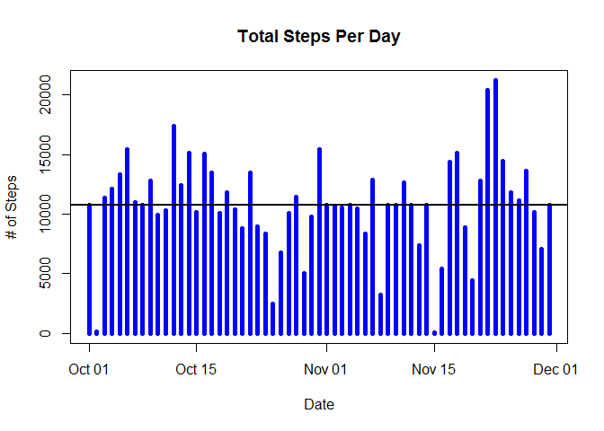

# Reproducible Research: Peer Assessment 1


###For this peer assessment we will answer a few questions using a sample dataset containing data obtained from personal activity monitorning devices. The sample dataset (activity.zip) is available via the Github folder. 

## Loading and preprocessing the data
First we will the csv file into R and explore the contents.

```r
actv_data <- read.csv('activity.csv')
str(actv_data)
```

```
## 'data.frame':	17568 obs. of  3 variables:
##  $ steps   : int  NA NA NA NA NA NA NA NA NA NA ...
##  $ date    : Factor w/ 61 levels "2012-10-01","2012-10-02",..: 1 1 1 1 1 1 1 1 1 1 ...
##  $ interval: int  0 5 10 15 20 25 30 35 40 45 ...
```

```r
summary(actv_data)
```

```
##      steps                date          interval     
##  Min.   :  0.00   2012-10-01:  288   Min.   :   0.0  
##  1st Qu.:  0.00   2012-10-02:  288   1st Qu.: 588.8  
##  Median :  0.00   2012-10-03:  288   Median :1177.5  
##  Mean   : 37.38   2012-10-04:  288   Mean   :1177.5  
##  3rd Qu.: 12.00   2012-10-05:  288   3rd Qu.:1766.2  
##  Max.   :806.00   2012-10-06:  288   Max.   :2355.0  
##  NA's   :2304     (Other)   :15840
```

```r
library(plyr)
```

```
## Warning: package 'plyr' was built under R version 3.2.5
```

```r
library(lattice)
```

```
## Warning: package 'lattice' was built under R version 3.2.5
```

## What is mean total number of steps taken per day?
THe total number of steps taken each day and the histogram.


```r
sum_data1 <- ddply(actv_data, "date", summarize, n= sum(!is.na(steps)),sum= sum(steps), mean=sum/n)
sum_data1$date <- as.Date(sum_data1$date, "%Y-%m-%d")
plot(sum_data1$date,sum_data1$sum, type = 'h', lwd=5, col="blue", main= "Total Steps Per Day", ylab="# of Steps", xlab="Date")
abline(h=mean(sum_data1$sum), lwd=2, col="red")
```

<!-- -->

The mean steps taken per day over the 2 month period.

```r
mean(sum_data1$sum, na.rm = TRUE)
```

```
## [1] 10766.19
```

The median steps taken per day over the 2 month period.

```r
median(sum_data1$sum, na.rm = TRUE)
```

```
## [1] 10765
```


## What is the average daily activity pattern?

```r
sum_data2 <- ddply(actv_data, c("interval"), summarize, n= sum(!is.na(steps)), sum= sum(steps,na.rm=TRUE), mean=sum/n)
plot(sum_data2$interval,sum_data2$mean, type = 'l', lwd=2, col="blue", main= "Avg Daily Activity Pattern", ylab="# of Steps", xlab="Interval")
abline(h=mean(sum_data2$mean), lwd=1, col="red")
```

<!-- -->


```r
sum_data2[which.max(sum_data2$mean),1]
```

```
## [1] 835
```

## Imputing missing values
There are many intervals where the step count is 'NA'. We will replace these 'NA' with the mean steps for that interval.
Let's first find the number of rows with "NA"s

```r
sum(is.na(actv_data$steps))
```

```
## [1] 2304
```


First we merge the original activity data table with "sum_data2" which contains the mean steps of each interval. We will merge by interval.

```r
data3 <- merge(x=actv_data, y=sum_data2, by = c("interval"))
str(data3)
```

```
## 'data.frame':	17568 obs. of  6 variables:
##  $ interval: int  0 0 0 0 0 0 0 0 0 0 ...
##  $ steps   : int  NA 0 0 0 0 0 0 0 0 0 ...
##  $ date    : Factor w/ 61 levels "2012-10-01","2012-10-02",..: 1 54 28 37 55 46 20 47 38 56 ...
##  $ n       : int  53 53 53 53 53 53 53 53 53 53 ...
##  $ sum     : int  91 91 91 91 91 91 91 91 91 91 ...
##  $ mean    : num  1.72 1.72 1.72 1.72 1.72 ...
```

```r
summary(data3)
```

```
##     interval          steps                date             n     
##  Min.   :   0.0   Min.   :  0.00   2012-10-01:  288   Min.   :53  
##  1st Qu.: 588.8   1st Qu.:  0.00   2012-10-02:  288   1st Qu.:53  
##  Median :1177.5   Median :  0.00   2012-10-03:  288   Median :53  
##  Mean   :1177.5   Mean   : 37.38   2012-10-04:  288   Mean   :53  
##  3rd Qu.:1766.2   3rd Qu.: 12.00   2012-10-05:  288   3rd Qu.:53  
##  Max.   :2355.0   Max.   :806.00   2012-10-06:  288   Max.   :53  
##                   NA's   :2304     (Other)   :15840               
##       sum               mean        
##  Min.   :    0.0   Min.   :  0.000  
##  1st Qu.:  131.8   1st Qu.:  2.486  
##  Median : 1808.0   Median : 34.113  
##  Mean   : 1981.3   Mean   : 37.383  
##  3rd Qu.: 2800.2   3rd Qu.: 52.835  
##  Max.   :10927.0   Max.   :206.170  
## 
```
Then we will replace all the "NA" values with the mean value for that interval and plot the data with total number of steps taken each day 

```r
data3$steps[is.na(data3$steps)] <- data3$mean[is.na(data3$steps)]
data3$date <- as.Date(data3$date, "%Y-%m-%d")
str(data3)
```

```
## 'data.frame':	17568 obs. of  6 variables:
##  $ interval: int  0 0 0 0 0 0 0 0 0 0 ...
##  $ steps   : num  1.72 0 0 0 0 ...
##  $ date    : Date, format: "2012-10-01" "2012-11-23" ...
##  $ n       : int  53 53 53 53 53 53 53 53 53 53 ...
##  $ sum     : int  91 91 91 91 91 91 91 91 91 91 ...
##  $ mean    : num  1.72 1.72 1.72 1.72 1.72 ...
```

```r
sum_data3 <- ddply(data3, c("date"), summarize, n= sum(!is.na(steps)),sum= sum(steps), mean=sum/n)
plot(sum_data3$date,sum_data3$sum, type = 'h', lwd=5, col="blue", main= "Total Steps Per Day", ylab="# of Steps", xlab="Date")
abline(h=mean(sum_data3$sum), lwd=2)
```

<!-- -->


```r
paste("The mean prior to replacement of NA Value =", mean(sum_data1$sum, na.rm = TRUE) )
```

```
## [1] "The mean prior to replacement of NA Value = 10766.1886792453"
```

```r
paste("The mean after replacement of NA Value =", mean(sum_data3$sum))
```

```
## [1] "The mean after replacement of NA Value = 10766.1886792453"
```

```r
paste("The median prior to replacement of NA Value =", median(sum_data1$sum, na.rm = TRUE) )
```

```
## [1] "The median prior to replacement of NA Value = 10765"
```

```r
paste("The median after replacement of NA Value =", median(sum_data3$sum))
```

```
## [1] "The median after replacement of NA Value = 10766.1886792453"
```
We observe the mean remains unchanged while the median is slightly higher. This makes sense since we replaced the "NA" with the mean value, so the average should be unaffected.

## Are there differences in activity patterns between weekdays and weekends?
Create variable "dayofweek" in the dataset (NA filled) with 2 factors: "Weekday","weekend"


```r
data4 <- data3
data4$date <- as.Date(data4$date, "%Y-%m-%d")
data4$dayofweek <- ifelse(weekdays(data4$date, abbreviate = TRUE) == "Sat", "Weekend", 
                    ifelse(weekdays(data4$date, abbreviate = TRUE) == "Sun","Weekend","Weekday"))
unique(count(data4$dayofweek))
```

```
##         x  freq
## 1 Weekday 12960
## 2 Weekend  4608
```
Obtain the average steps per interval across all the days and make a plot of the activity pattern between weekdays and weekends.

```r
d4 <- ddply(data4, c("interval","dayofweek"), summarize, n= sum(!is.na(steps)),sum= sum(steps), mean=sum/n)
xyplot( d4$mean ~ d4$interval | d4$dayofweek, type = "l", layout = c(1, 2), 
    xlab = "Interval", ylab = "Number of steps")
```

<!-- -->


